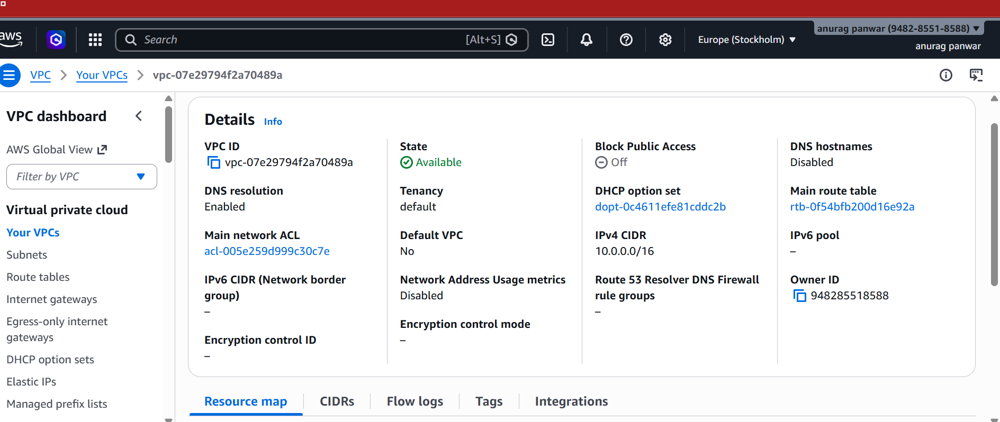
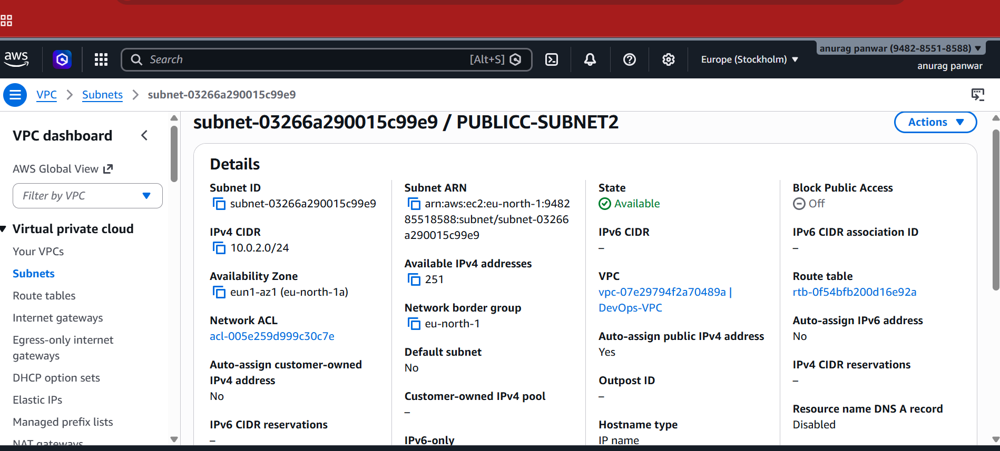
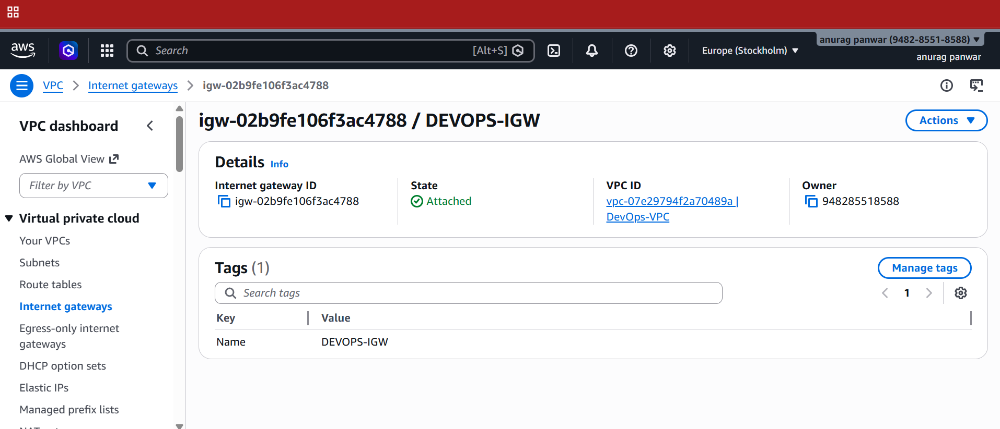
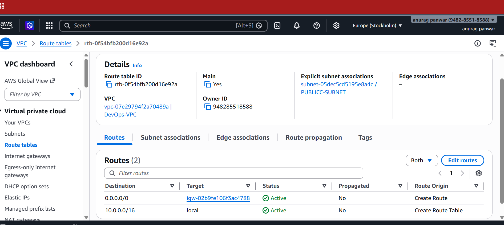
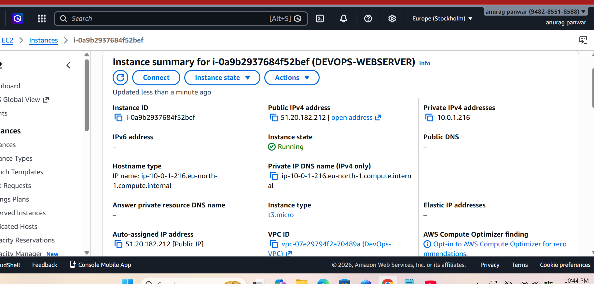
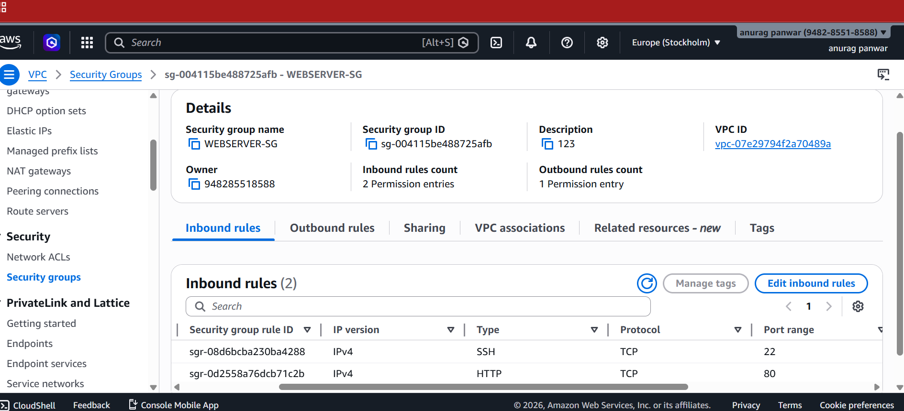

## Project 3 — Custom VPC and Secure Web Server Architecture

## Overview
This project demonstrates building a custom network in AWS using VPC and deploying a secure EC2 instance.

##  Architecture
User → Internet Gateway → EC2 (Public Subnet) → Security Group

##  Technologies Used
- AWS VPC
- EC2
- Subnets
- Internet Gateway
- Route Tables
- Security Groups

##  Implementation Steps
1. Created a custom VPC
2. Configured public subnet
3. Attached Internet Gateway
4. Created route table and linked to subnet
5. Launched EC2 instance inside VPC
6. Configured security groups

##  Features
- Custom network isolation
- Controlled traffic using security groups
- Public access via internet gateway

##  Learning Outcomes
- Networking fundamentals in AWS
- Traffic routing and access control
- Secure architecture design
